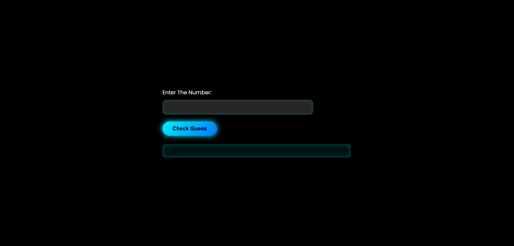

🎮 Guess Number Game 🎮

Welcome to the Guess Number Game! The game is simple: a random number between 1 and 100 is generated, and you need to guess it. With each guess, you'll receive feedback on whether your guess is too high, too low, or correct.

📜 Project Overview:
The Guess Number Game is developed using HTML, CSS, and JavaScript. The goal of the game is to guess a randomly generated number between 1 and 100. You’ll receive feedback based on your guess, whether it’s higher, lower, or correct.

✨ Features:
Random Number Generation: A random number between 1 and 100 is generated.

Instant Feedback: You’ll receive immediate feedback if your guess is too high, too low, or correct.

Attempts Counter: Tracks how many attempts you made to guess the correct number.

Sleek UI: A clean, modern interface with animations and interactive buttons.

🎨 Technologies Used:
HTML: Markup language for structuring the game layout.

CSS: Styling the user interface with modern design and animations.

JavaScript: Handling the game logic, random number generation, and user input.

🧩 How to Play:
Start the Game: Open the webpage and input a guess between 1 and 100.

Check Your Guess: Click the "Check Guess" button to see if your guess is correct.

Receive Feedback: The system will tell you if your guess is too high, too low, or correct.

Keep Guessing: Keep guessing until you find the correct number.

🖼️ Screenshots:

This is the sleek and modern interface of the game, designed to enhance the user experience.

💻 How to Run Locally:

To run this project locally:

1. Clone the repository to your machine:

(git clone https://github.com/BolaGehad/Guess-Number-Game.git)

2.Navigate to the project folder:

(cd Guess-Number-Game)

3.Open index.html in your browser:

(open index.html)

👾 Enjoy the Game! 🎯
